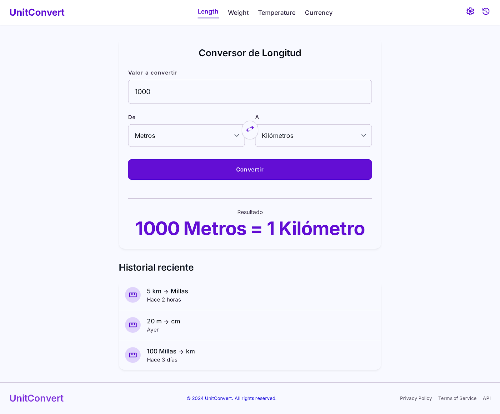

# Conversor de Unidades

Aplicación web para convertir medidas de longitud, peso, temperatura y moneda, construida
con JavaScript (ES Modules), HTML y CSS, sin frameworks.



## Descripción

La aplicación permite convertir valores entre distintas unidades organizadas por categoría
(longitud, peso, temperatura, moneda), con selección de unidad de origen y destino,
intercambio rápido entre ambas y un historial de conversiones recientes.

## Funcionalidades

- Conversión de longitud (metros, kilómetros, millas, pies)
- Conversión de peso (kilogramos, gramos, libras)
- Conversión de temperatura (Celsius, Fahrenheit, Kelvin)
- Conversión de moneda con tasas de cambio actualizadas mediante API externa
- Intercambio rápido entre unidad de origen y destino
- Historial de conversiones recientes persistido en `localStorage`

## Checklist de desarrollo

### Estructura y base

- [x] Estructura de carpetas y archivos
- [x] `index.html` con maquetado base (tabs, tarjeta de conversión, historial)
- [x] `style.css` aplicando el sistema de diseño

### Conversión de medidas

- [x] Tabla de conversión de longitud como objeto de factores
- [x] Tabla de conversión de peso como objeto de factores
- [x] Función de conversión de longitud (`longitud.js`)
- [x] Función de conversión de peso (`peso.js`)

### Conversión de temperatura

- [x] Fórmulas de conversión Celsius ⇄ Fahrenheit ⇄ Kelvin (`temperatura.js`)

### Conversión de moneda

- [x] Definición de API externa de tasas de cambio
- [x] Función de conversión de moneda (`moneda.js`)
- [ ] Manejo de errores de red y estado de carga

### Interacción y UI

- [ ] Navegación por tabs entre categorías de conversión
- [ ] Botón "Convertir" conectado a la función correspondiente
- [ ] Botón de intercambio de unidades
- [ ] Renderizado del resultado

### Historial

- [ ] Persistencia de conversiones recientes en `localStorage`
- [ ] Renderizado del historial en la UI

## Aspectos técnicos

| Concepto                          | Aplicación en el proyecto                                     |
| --------------------------------- | ------------------------------------------------------------- |
| `reduce`                          | Procesamiento de datos del historial de conversiones          |
| Destructuring                     | Extracción de propiedades de objetos y arrays                 |
| Spread/rest (`...`)               | Combinación y clonado de datos sin mutación                   |
| Closures                          | Configuración/unidad por defecto recordada entre conversiones |
| Módulos de JS (`import`/`export`) | Separación del código por responsabilidad                     |
| Funciones puras                   | Lógica de conversión desacoplada del DOM                      |
| Objetos como tablas de conversión | Factores de conversión por categoría de unidad                |

## Estructura del proyecto

```
conversor-unidades/
├── index.html
├── README.md
├── .gitignore
├── css/
│   └── style.css
├── js/
│   ├── app.js
│   ├── conversores/
│   │   ├── longitud.js
│   │   ├── peso.js
│   │   └── temperatura.js
│   └── historial.js
└── docs/
    ├── DESIGN-SYSTEM.md
    └── preview.png
```

## Tecnologías

- JavaScript (ES Modules)
- HTML5
- CSS3
- API externa de tasas de cambio (Frankfurter)

## Diseño

El sistema de diseño (paleta de colores, tipografía, espaciado y componentes) está
documentado en [`docs/DESIGN-SYSTEM.md`](docs/DESIGN-SYSTEM.md).

## Licencia

MIT
